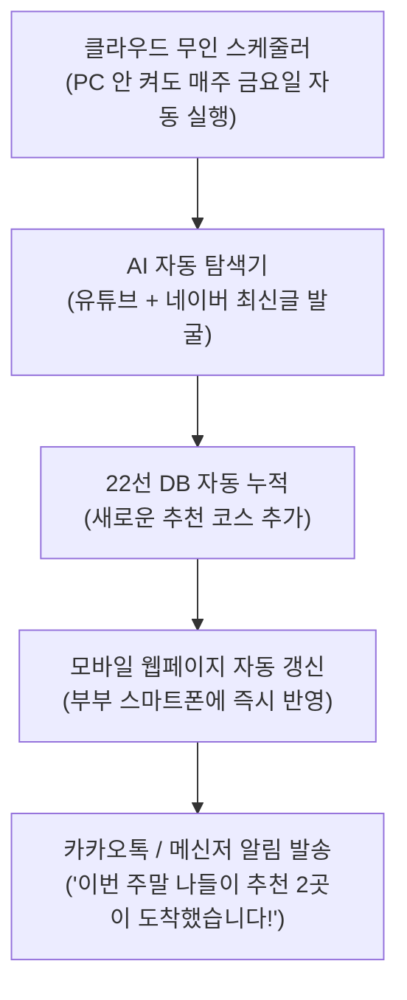

# [최종 기획안] 부부 공유형 무인 자동 업데이트 & 알림 가족 나들이 시스템

컴퓨터를 자주 켜지 않고 명령어를 다루기 어려워하시는 상황과, **"와이프와 함께 스마트폰으로 편하게 보고, 자동으로 새 여행지가 업데이트되며, 카톡처럼 알림을 받고 싶다"**는 요구사항을 100% 만족시키는 현실적이고 가장 편리한 자동화 아키텍처를 수립했습니다.

---

## 1. 사용자가 손댈 필요 없는 '3無 (무설치·무명령·무비용)' 자동화 구조

> [!IMPORTANT]
> **핵심 해결책: PC를 켜두지 않아도 클라우드가 대신 일하고, 부부 스마트폰으로 쏴주는 구조**
> 
> 데스크탑에서 프로그램을 돌리면 컴퓨터가 꺼져 있을 때 작동하지 않고 오류가 날 수 있습니다.
> 대신 **무료 클라우드(GitHub Actions + GitHub Pages)**를 활용하면:
> 1. **PC를 아예 켜지 않아도** 매주 정해진 시간(예: 매주 금요일 아침 8시)에 AI가 알아서 새 여행지를 발굴합니다.
> 2. 발굴된 코스가 **부부가 공유하는 모바일 웹페이지에 자동으로 반영**됩니다.
> 3. 업데이트 즉시 **카카오톡(또는 부부 전용 알림봇)으로 "이번 주말 추천 코스" 알림 메시지**가 도착합니다.

---

## 2. 부부 스마트폰 공유 및 사용 경험 (UX)

### (1) 스마트폰 '홈 화면'에 앱처럼 설치 (1분 완료)
- 남편분과 아내분의 스마트폰(아이폰 사파리 or 갤럭시 크롬)에서 고유 웹 주소로 접속 후 **[홈 화면에 추가]**를 누르면, 스마트폰 바탕화면에 **'우리 가족 나들이'** 앱 아이콘이 생깁니다.
- 별도 앱 설치나 로그인 없이 아이콘 터치 한 번으로 언제든 바로 열립니다.

### (2) 화면 구성 (한 손 조작)
- **상단 탭**: `[4인 아이 자연체험]` ↔ `[6인 조부모 안심 배리어프리]` 원터치 전환
- **권역 필터**: `[전체]` `[서부: 인천/송도/시흥]` `[동부: 남양주/양평/가평]` `[남부: 광주/용인/이천]` `[북부: 포천/파주/구리]`
- **상세 카드**:
  - `[코스 요약]`: 1. 오전 자연체험 ➔ 2. 점심 맛집 (4인 10만원 이하) ➔ 3. 오후 전망/베이커리 카페
  - `[원클릭 길찾기]`: 카카오내비 / 네이버지도 누르면 우리집(`미사강변중앙로 120`)에서 목적지까지 자동 경로 안내
  - `[출처 확인]`: 참고한 유튜브 영상 바로보기 & 네이버 블로그 찐리뷰 링크

---

## 3. 카카오톡 / 메신저 알림 수신 방식

알림은 다음 두 가지 중 가장 편하신 방식을 선택하여 연동할 수 있도록 설계합니다:

1. **카카오톡 '나에게 보내기' 자동 알림**:
   - 카카오 개발자 센터의 메시지 API를 연동하여, 새 추천 코스가 생길 때마다 내 카카오톡으로 `[이번 주말 추천 여행지 도착!]` 카톡 메시지를 발송 (와이프분에게 전달/공유 가능).
2. **부부 전용 텔레그램 알림방 (가장 간편하고 강력한 추천)**:
   - 카카오톡 API는 인증 토큰이 주기적으로 만료되어 재로그인해야 하는 기술적 번거로움이 있습니다.
   - 대신 **텔레그램에 남편분과 아내분이 함께 들어간 '가족 여행 알림방'**을 1분 만에 만들고 봇을 초대해 두면, 영구적으로 토큰 만료 없이 매주 금요일마다 예쁜 카드 형태로 사진과 링크가 자동 전송됩니다.

---

## 4. 즉시 구축할 작업 목록 (Roadmap)

### Step 1. 마스터 데이터 및 모바일 웹앱 구축 (지금 바로 착수)
1. **`trips_data.json`**:
   - 4방위(서해 인천·송도 포함) 22개 코스 풀패키지 데이터 구축 (자연체험 + 4인 10만원 이하 맛집 + 뷰/베이커리 카페 + 미사 출발 길찾기 링크)
2. **`index.html`**:
   - 스마트폰 화면에 완벽하게 최적화된 반응형 모바일 웹앱 생성
3. **`mobile_guide.md`**:
   - 스마트폰 메모장이나 카카오톡에 바로 복사해 둘 수 있는 22선 요약본

### Step 2. 자동 업데이트 엔진 & 알림 스크립트 작성
1. **`auto_collector.py`**:
   - 하남 미사 기준 새로운 유튜브/네이버 여행 콘텐츠를 AI로 검색·추출하여 DB에 자동 누적하는 스크립트
2. **`send_alert.py`**:
   - 새로 업데이트된 여행지를 카카오톡/텔레그램으로 자동 발송하는 알림 모듈
3. **`[클라우드 자동 실행 가이드.md]`**:
   - 컴퓨터를 켜지 않아도 자동으로 돌아가게 하는 초간단 무료 클라우드(GitHub Pages/Actions) 배포 및 알림 설정 가이드 (클릭 몇 번으로 끝낼 수 있게 화면 캡처 수준으로 안내)

---

## 5. 검증 계획 (Verification Plan)
- 22개 코스 전체의 데이터 무결성 검증 (4인 식비 10만원 이하, 배리어프리 조건, 카페 매칭, 미사강변중앙로 120 출발 길찾기 링크).
- `index.html`이 스마트폰 브라우저에서 버벅임 없이 터치/동작하는지 검증.
- 자동 수집 및 알림 스크립트가 오류 없이 동작하는지 테스트.
